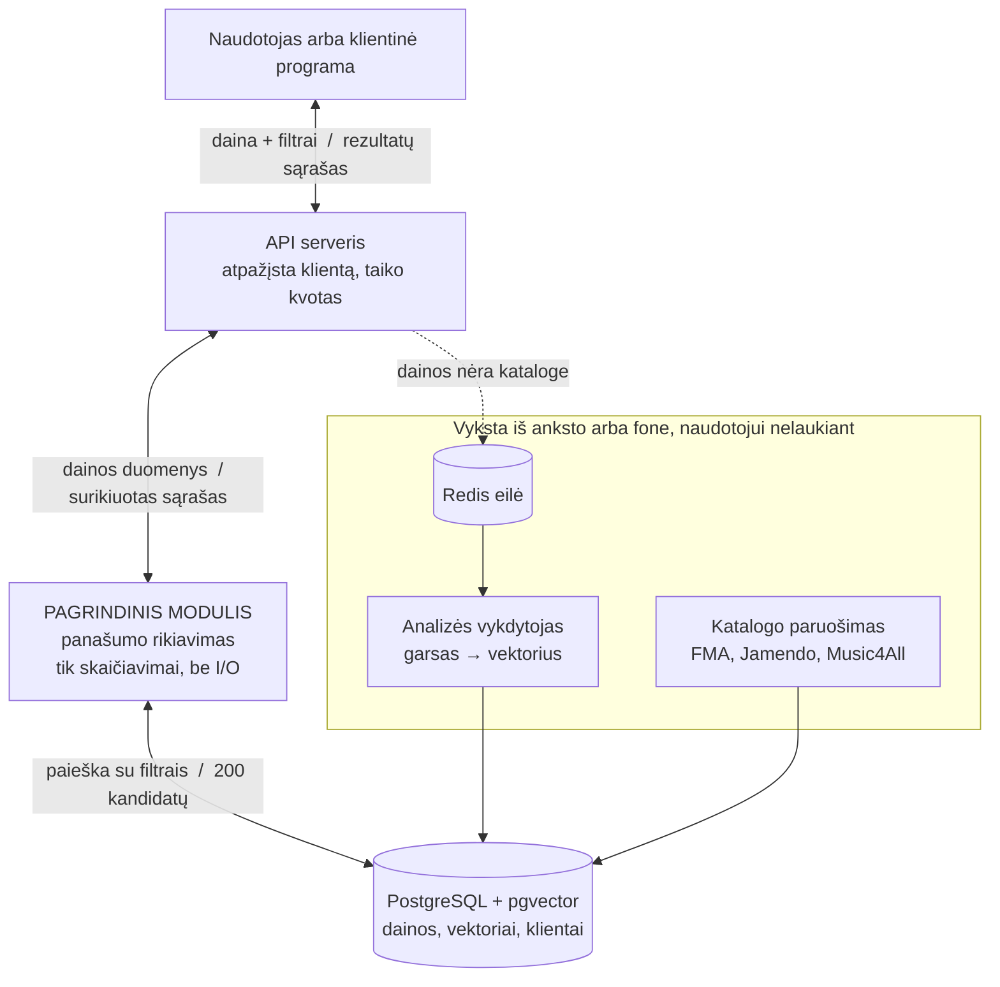

# Timbre – panašiai skambančių dainų paieška

Kursinio darbo I dalis: projektavimo dokumentas

## 1. Problema ir idėja

**Sistema vienu sakiniu:** sistema, kuriai pateikus vieną dainą (nuorodą arba įkeltą failą) ji suranda panašiai **skambančias** dainas, leidžia rezultatus susiaurinti pagal muzikinius parametrus ir paaiškina, kodėl kiekviena daina pasiūlyta.

**Problema ir dabartinis procesas:** Spotify, Last.fm ir panašios platformos rekomendacijas skaičiuoja iš klausymo statistikos – „ką dar klausė žmonės, klausę šio atlikėjo“. Tokie duomenys susieti su atlikėju ir populiarumu, o ne su tuo, kaip daina skamba. Todėl patikus netipinei populiaraus atlikėjo dainai – pavyzdžiui, vieninteliam lėtam instrumentiniam kūriniui roko albume – rekomendacijose gaunamas įprastas to atlikėjo repertuaras.

| Dabartinis būdas | Trūkumas |
|---|---|
| Rankinė paieška per „panašius atlikėjus“ ir žanrų grojaraščius | Lėta, rezultatas atsitiktinis, veikia atlikėjo, o ne atskiros dainos lygiu |
| Nemokami įrankiai (Musicstax, Chosic, Tunebat) | Naudojo Spotify teikiamus dainų parametrus, bet Spotify šią sąsają naujoms programoms išjungė 2024-11-27 |
| Profesionalios paslaugos (Cyanite.ai, AIMS) | Veikia dainos lygiu, bet mokamos (Cyanite – apie 290 EUR/mėn.) ir skirtos įmonėms |

**Nauda:** panašumas skaičiuojamas iš konkrečios dainos garso, ne iš atlikėjo etiketės; rezultatus galima susiaurinti pagal tempą, tonaciją ar instrumentalumą; matomas paaiškinimas, kodėl daina pasiūlyta. Kadangi populiarumas skaičiavime nedalyvauja, į viršų gali pakilti ir mažai klausomos dainos – to klausymo statistika grįsti modeliai negali.

**Naudotojai:**

- **DJ arba prodiuseris** – pateikia dainą, nurodo tempo ir tonacijos ribas, gauna kandidatus į setą.
- **Klausytojas** – pateikia nuorodą ir gauna panašiai skambančių dainų sąrašą.
- **Muzikos biblioteka** – įmonė, turinti savo dainų rinkinį (**katalogą**) ir parduodanti licencijas jį naudoti filmuose, reklamose ar žaidimuose. Jai reikia greitai rasti savo kataloge dainą, skambančią panašiai į tai, ko paprašė klientas. Šis naudotojas pagrindžia klientų atskyrimą: skirtingos bibliotekos turi skirtingus, vienos nuo kitos paslėptus katalogus.

**Prielaidos:**

- *Žinoma:* Spotify nuo 2024-11-27 naujoms programoms nebeteikia dainų garso parametrų, todėl juos tenka skaičiuoti pačiam; nuoroda naudojama tik dainai atpažinti.
- *Prielaida:* dainos charakteriui apibūdinti pakanka 30 sekundžių fragmento (tikrinsiu matavimu, 7 skyrius).
- *Prielaida:* viešos žanrų ir nuotaikos žymos, kurias dainoms priskyrė žmonės, yra pakankamas pagrindas tikrinti paieškos teisingumą, kol neturiu klausytojų vertinimų.
- *Prielaida:* katalogas apdorojamas iš anksto. Vienos dainos analizė trunka kelias sekundes, tad 100 000 dainų neįmanoma apdoroti naudotojui laukiant. Visos katalogo dainos apdorojamos iš anksto, o jų skaičiai sudedami į **indeksą** – paieškai paruoštą struktūrą, kurioje artimiausios dainos randamos nepatikrinus visų. Užklausa ieško tik tarp jau apdorotų dainų.

## 2. Apimtis

| Funkcija | Ką naudotojas galės atlikti | Pagrindinis modulis ar pagalbinė funkcija |
|---|---|---|
| Panašių dainų paieška | Pateikti dainą ir gauti surikiuotą sąrašą su paaiškinimais | **Pagrindinis modulis** |
| Filtrai ir svorių keitimas | Nurodyti tempo, tonacijos, instrumentalumo ribas; keisti kriterijų svorius | **Pagrindinis modulis** |
| Dainos atpažinimas ir analizė | Pateikti nuorodą arba įkelti failą; sistema dainą atpažįsta arba išanalizuoja | Pagalbinė |
| Katalogo paruošimas | Apdoroti katalogą prieš naudojimą; įkelti savo katalogą | Pagalbinė |
| Klientai, API raktai, kvotos | Susikurti paskyrą, gauti API raktą, matyti savo limitus | Pagalbinė |

Paskutinė funkcija reikalinga, nes sistema skirta ne tik žmonėms per svetainę, bet ir kitoms programoms. Programa kreipiasi į **API** – sąsają, per kurią viena programa siunčia užklausas kitai. Kad sistema žinotų, kuri programa kreipiasi, kiekvienas klientas gauna **API raktą** (ilgą unikalią simbolių eilę, siunčiamą su kiekviena užklausa panašiai kaip slaptažodis). Pagal raktą taikomos **kvotos** – limitai, kiek paieškų klientas gali atlikti per minutę ar dieną. Be jų viena netvarkingai parašyta programa siųstų tūkstančius užklausų per sekundę ir sistema nustotų veikti visiems.

**Į kursinio darbo apimtį neįeina:**

- **Garso failų saugojimas ir muzikos atkūrimas.** Sistema nebus grotuvas: įrašas reikalingas vieną kartą, kad iš jo būtų apskaičiuoti skaičiai, po to failas ištrinamas. Rezultatuose bus nuoroda klausyti dainos Spotify ar YouTube, ne pats įrašas.
- **Muzikos generavimas** – sistema naujos muzikos nekuria, tik ieško tarp esamos.
- **Dainų tekstų analizė** – panašumas skaičiuojamas tik iš garso.
- **Viso komercinio katalogo aprėptis** – tik tiek dainų, kiek pavyks apdoroti iš atvirų rinkinių.
- **Mokėjimai** – paskyros bus, bet prenumeratos pirkti negalima.
- **Rekomendacijos pagal naudotojų elgseną** – sistema neseks, ką naudotojai klauso; klausymo statistiką naudosiu tik kaip paprastesnį variantą rezultatams palyginti.

## 3. Pagrindinis modulis

**Pavadinimas ir atsakomybė:** *Panašumo rikiavimo modulis*. Gauna duomenis apie pateiktą dainą, filtrus ir svorius, grąžina surikiuotą, nuo pasikartojimų išvalytą ir paaiškintą dainų sąrašą.

Trys terminai, kurie kartojasi visame dokumente:

- **Vektorius** – neuroninis tinklas kiekvieną dainą paverčia ilga skaičių eile, savotišku garso „atspaudu“. Panašiai skambančių dainų vektoriai yra arti vienas kito.
- **Kosinuso panašumas** – skaičius nuo 0 iki 1, rodantis, kaip arti yra du vektoriai (1 – praktiškai identiškas garsas). „Atstumas tarp dainų“ reiškia būtent tai.
- **Indeksas** – paieškai paruoštas apdorotų dainų vektorių rinkinys, leidžiantis rasti artimiausias dainas nepatikrinus visų iš eilės.

**Kodėl modulis nieko neparsiunčia pats.** Jis gauna paruoštus skaičius ir tik skaičiuoja: nesikreipia į internetą, neatidaro garso failų, nesirašo į duomenų bazę – tuos darbus atlieka kitos sistemos dalys. Nauda praktinė: priešingu atveju kiekvienam testui reikėtų paleisti duomenų bazę, turėti garso failų ir veikiantį internetą. Dabar testui pakanka sugalvoti skaičius ranka („daina A: 124 BPM, instrumentinė; daina B: 126 BPM“) ir patikrinti rezultatą. Tokie testai veikia per milisekundes ir nelūžta dėl išorinių priežasčių. Tai svarbiausias projektavimo sprendimas šiame modulyje.

**Logika, kurią reikės projektuoti ir testuoti:** penkių skirtingų kriterijų suvedimas į vieną balą, tempo dviprasmybės ir tonacijų suderinamumo skaičiavimas, pasikartojimų ir to paties atlikėjo ribojimas, rezultatų įvairovė, elgesys per siauro filtro atveju ir neuroninio tinklo išvesties patikra.

**Įvestis:**

```
daina:   { vektorius: 256 skaičiai, tempas: 124 BPM (dūžiai per minutę),
           tonacija: "8A" (pasitikėjimas 0.81), garsumas: -8.2,
           nuotaikos: {instrumentinė: 0.93, tamsi: 0.71}, atlikėjas: "A-1021" }
filtrai: { tempas: [118, 130], tik_instrumentinės: true }
svoriai: { vektorius: 0.70, tempas: 0.10, tonacija: 0.05, garsumas: 0.05, nuotaika: 0.10 }
klientas:{ katalogai: ["t-77", "bendras"], limitas_atlikėjui: 1, rezultatų: 10 }
```

**Išvestis:**

```
{ "rezultatai": [
    { "daina": "Nightfield", "atlikėjas": "Kepler Grove", "balas": 0.874,
      "tempas": 126.0, "tonacija": "8A",
      "kodėl": ["124 ir 126 BPM", "abi instrumentinės", "tonacijos dera"] } ],
  "dalinis_rezultatas": false }
```

**Veikimo eiga:**

1. Filtrai paverčiami duomenų bazės užklausa kartu su nurodymu, kuriuose kataloguose klientui leidžiama ieškoti.
2. Paimama 200 kandidatų, arčiausių pateiktos dainos vektoriui. Filtrai pritaikomi **paieškos metu, o ne po jos** – jei pirma paimtume 200 arčiausių dainų, o tik paskui išmestume filtro neatitinkančias, liktų vos kelios arba nė viena. Todėl paieška netinkamas dainas praleidžia iš karto.
3. Kiekvienam kandidatui apskaičiuojami kriterijų balai ir sujungiami į vieną svorinį balą.
4. Pašalinamos pasikartojančios dainos, pritaikomas atlikėjo limitas, sąrašas perrikiuojamas pagal įvairovę ir apkarpomas.
5. Suformuojami paaiškinimai iš labiausiai sutampančių požymių.

### Taisyklės arba sprendimo žingsniai

1. **Tempo sutapimas, atsižvelgiant į dvigubinimą.** Tempą nustatantys algoritmai dažnai klysta lygiai dvigubai (120 dūžių per minutę atpažįsta kaip 60), nes muzikoje abu skaičiavimo būdai teisingi. Todėl skirtumas skaičiuojamas trimis būdais ir imamas mažiausias: `Δ = min(|b₁ − b₂|, |2·b₁ − b₂|, |b₁ − 2·b₂|)`, o balas `exp(−(Δ/6)²)` – jis lygus 1,0 prie nulinio skirtumo ir greitai artėja prie nulio skirtumui didėjant. 120 ir 60 BPM gauna 1,0 (tempas laikomas tuo pačiu), 120 ir 126 – apie 0,37, o 120 ir 132 – jau tik apie 0,02.
2. **Tonacijų suderinamumas.** Naudojamas Camelot ratas – DJ schema, kurioje tonacijos sudėtos ratu taip, kad gretimos skamba kartu gerai. Balas `max(0, 1 − žingsniai/4)` padauginamas iš tonacijos nustatymo pasitikėjimo (skaičiaus nuo 0 iki 1, kurį pateikia analizės programa). Taip netiksliai nustatyta tonacija beveik neturi įtakos balui – reikalinga apsauga, nes iškreiptoje gitarinėje muzikoje tonacija nustatoma klaidingai dažnai.
3. **Bendras balas – svorinė suma:** kiekvienas iš penkių balų dauginamas iš savo svorio ir sudedama. Svorių suma visada perskaičiuojama į 1, todėl balas garantuotai yra tarp 0 ir 1, kokius svorius naudotojas benurodytų.
4. **Pasikartojimų išmetimas.** Kandidatas atmetamas, jei kosinuso panašumas su jau atrinkta daina didesnis nei 0,98 (tas pats įrašas kitu pavadinimu) arba sutampa sunormintas pavadinimas – norminant nuimama `Remix`, `Live`, `Remaster`, `Radio Edit`, `feat.` ir skliaustų turinys. Kitaip rezultatuose atsirastų ta pati daina penkiais variantais.
5. **Atlikėjo limitas.** Pateiktos dainos atlikėjas išmetamas visada – naudotojas ieško ne to paties atlikėjo. Iš kitų atlikėjų įtraukiama ne daugiau nei limitas (numatytai viena daina), kad dešimtuko neužimtų vienas albumas.
6. **Įvairovė.** Iš kandidato balo atimama dalis, parodanti, kaip jis panašus į jau atrinktas dainas (70 % balui, 30 % įvairovei). Be šio žingsnio dešimtuke atsirastų dešimt beveik vienodų dainų, nes arčiausios pateiktai dainai paprastai artimos ir viena kitai.
7. **Per siauras filtras.** Jei rezultatų mažiau nei prašyta, modulis negrąžina tuščio sąrašo tyliai: grąžina tai, ką turi, pažymi `dalinis_rezultatas: true` ir nurodo labiausiai apribojusį filtrą, kad naudotojas žinotų, ką atlaisvinti.

### Scenarijai būsimiems testams

| Scenarijus | Pradinės sąlygos ir konkreti įvestis | Veiksmas | Tikslus laukiamas rezultatas |
|---|---|---|---|
| Įprastas atvejis | Katalogas 100 000 dainų. Pateikta instrumentinė daina, 124 BPM, tonacija 8A. Filtrai: tempas 118–130, tik instrumentinės. Prašoma 10 | Paieška | 10 rezultatų; visų tempas 118–130; visos instrumentinės; nė vienos pateiktos dainos atlikėjo; ne daugiau 1 iš to paties atlikėjo; balai mažėja; kiekviena su bent 2 paaiškinimais; `dalinis_rezultatas: false` |
| Ribinis atvejis arba konfliktas | Tas pats katalogas. Filtrai: tempas 121–123, tik instrumentinės, tonacija 8A – juos atitinka tik 4 dainos | Paieška, prašoma 10 | Grąžinamos 4 dainos (ne 0 ir ne klaida), `dalinis_rezultatas: true`, nurodoma, kad ribojo tempo filtras. Testas tikrina, kad nepateko nė viena daina už filtro ribų |
| Klaida arba neįmanomas rezultatas | Nuoroda į dainą, kurios nėra kataloge ir kurios įrašo nepavyko gauti | Paieška | Klaida su paaiškinimu ir pasiūlymu įkelti failą. Antras variantas: 3 sekundžių failas atmetamas klaida „įrašas per trumpas“ (reikia bent 15 s). Niekada negrąžinamas atsitiktinis ar tuščias sąrašas |

**Jei modulis naudoja AI:** taip. Panašumo erdvę sukuria neuroninis tinklas `Essentia discogs-effnet` (apmokytas atskirti 400 muzikos stilių, todėl jo vektoriai jau neša informaciją apie stilių), palyginimui – `LAION-CLAP`.

- *Įvesties paruošimas.* Įrašai **suvienodinami** – perkoduojami į tą patį formatą (16 000 pavyzdžių per sekundę, vienas kanalas), kitaip vektorius skirtųsi dėl įrašo kokybės, ne dėl muzikos. Tinklo išvesti skaičiai suvidurkinami, sutrumpinami iki 256 ir **normalizuojami** – visų vektorių ilgis padaromas vienodas, todėl lyginant skiriasi tik kryptis, ne mastelis; kitaip tyliau įrašyta daina atrodytų nepanaši vien dėl garsumo.
- *Atsakymo tikrinimas.* Ar vektoriuje nėra **tuščių reikšmių** (nepavykus skaičiavimui vietoje skaičiaus gaunama reikšmė „ne skaičius“, su kuria paieška grąžintų šiukšles), ar ilgis po normalizavimo teisingas, ar tinklo tikimybės yra tarp 0 ir 1.
- *Elgesys gavus netinkamą rezultatą.* Daina **neindeksuojama** – neįtraukiama į paieškai naudojamą rinkinį, todėl rezultatuose jos nebus; pažymima kaip neišanalizuota su priežastimi, kad vėliau būtų galima bandyti iš naujo.
- *Kokybės vertinimas.* Tikrinsiu, kiek iš 10 rastų dainų turi tą pačią žanro ar nuotaikos žymą kaip pateiktoji. **Būtina išmesti to paties atlikėjo dainas**: jo kūriniai įrašyti toje pačioje studijoje ir skamba panašiai, tad juos palikus būtų matuojama, ar sistema atpažįsta atlikėją, o ne ar randa panašią muziką.
- *Kodėl nevertinsiu pagal patį tinklą.* Tas pats tinklas ir sukuria vektorius, ir spėja žanrą; tikrindamas jo rezultatus jo paties spėjimais klausčiau tinklo, ar jis teisus – ir jis sutiktų su savimi net klysdamas. Todėl naudosiu tik žmonių priskirtas žymas, o rezultatus lyginsiu su trimis paprastesniais variantais: atsitiktiniu pasirinkimu, paieška pagal tempą ir tonaciją, ir paieška pagal paprastas garso charakteristikas. Jei sistema jų neaplenkia, tinklas nieko neprideda.

## 4. Kokybės atributas

**Pasirinktas atributas:** spartumas.

**Kodėl svarbus šiai sistemai:** paieška – vienintelis veiksmas, kurio naudotojas laukia, ir sunkiausia sistemos vieta: įprastoje duomenų bazėje ieškoma pagal vieną lauką, o čia pagal 256 skaičius vienu metu, dar ir su filtrais. Prisideda 3 skyriuje aprašytas filtravimo klausimas – sparta ir teisingumas susiję, nes negalima „ieškoti greičiau“, nepatikrinus, ar paieška nepradėjo praleidinėti tinkamų dainų.

**Tikrinimo scenarijus ir sąlygos:** 100 000 dainų katalogas, 20 vienu metu dirbančių naudotojų, 5 minučių **apkrovos testas** (automatinė programa, nuolat siunčianti užklausas ir matuojanti atsako laikus). 30 % užklausų su siauru filtru, atitinkančiu 1–5 % katalogo.

**Sėkmės kriterijus:**

- 95 % užklausų atsakoma greičiau nei per 200 ms (iš 100 užklausų ne daugiau kaip 5 lėtesnės);
- pati vektorių paieška 95 % atvejų greitesnė nei 50 ms;
- su filtrais paieška randa bent 95 % tų dainų, kurias rastų pilnas visų 100 000 dainų patikrinimas po vieną – greitoji paieška gali praleisti ne daugiau 5 % teisingų atsakymų.

**Numatytas projektavimo sprendimas:** PostgreSQL su `pgvector` plėtiniu, leidžiančiu vektorių paiešką SQL užklausoje. Naudosiu ne senesnę nei 0.8 versiją – joje atsirado kartotinis indekso skenavimas: jei po filtravimo kandidatų nepakanka, paieška automatiškai eina į indeksą dar kartą. Papildomai: įprasti indeksai tempo ir instrumentalumo laukams, kad filtravimas būtų greitas; balai perskaičiuojami tik 200 kandidatams; pasikartojančios užklausos saugomos atmintyje valandai.

**Kaip patikrinsiu vėlesniame etape:** apkrovos testas `k6` įrankiu – jis pateikia atsako laikų ataskaitą. Tikslumą tikrinsiu atskirai: tą patį užklausų rinkinį paleisiu per pilną katalogo patikrinimą (`FAISS` biblioteka lygina su visomis dainomis iš eilės – lėta, bet duoda tikrai teisingą atsakymą) ir suskaičiuosiu, kiek procentų greitoji paieška rado teisingai, esant 1 %, 5 % ir 20 % filtro siaurumui.

**Sprendimo kaina arba ribojimas:** indeksas laikomas operatyviojoje atmintyje, tad kuo didesnis katalogas, tuo daugiau atminties reikia serveriui. Pakeitus tinklą indeksas tampa nenaudingas (nauji vektoriai nesulyginami su senais) ir jį reikia perstatyti nuo nulio – todėl prie kiekvieno vektoriaus saugosiu, kuris tinklas jį sukūrė. Pagrindinis kompromisas: kuo giliau paieška eina į indeksą, tuo mažiau praleidžiama, bet tuo ilgiau laukiama; galutinę reikšmę parinksiu pagal matavimus.

---

**Antras atributas:** palaikomumas ir plečiamumas.

**Kodėl svarbus šiai sistemai:** iš anksto nežinau, kurie kriterijai ir svoriai duos geriausią rezultatą – paaiškės tik po eksperimentų, tad kriterijus teks kelis kartus pridėti, išmesti ir performuluoti. Jei kiekvienas pakeitimas reikš esamos logikos perrašymą ir senų testų gadinimą, eksperimentuoti bus per rizikinga ir liksiu su pirmu atspėtu variantu.

**Tikrinimo scenarijus ir sąlygos:** pridedu naują kriterijų (ritmo tipo sutapimą – ar abiejose dainose vienodai tolygus būgnų pulsas) ir pakeičiu neuroninį tinklą iš `discogs-effnet` į `CLAP`.

**Sėkmės kriterijus:** naujas kriterijus įgyvendinamas kaip **viena nauja klasė ir vienas įrašas konfigūracijoje**, nepakeitus nė vienos esamos kriterijaus klasės ir jų sujungimo klasės; parodysiu `git diff` komanda, rodančia pakeistas eilutes. Visi ankstesni testai turi praeiti be pakeitimų. Tinklas pakeičiamas pakeitus vieną konfigūracijos reikšmę, nekeičiant modulio kodo.

**Numatytas projektavimo sprendimas:** kiekvienas kriterijus – atskira klasė su tuo pačiu metodų rinkiniu (Strategy šablonas); jas surenka sujungimo klasė, nežinanti, kiek jų yra ir ką jos skaičiuoja. Garso šaltiniai paslėpti už vienos sąsajos, duomenų bazė – už Repository sąsajos su dviem realizacijomis. Tai Open-Closed („atviras praplėtimui, uždaras modifikavimui“) ir Dependency Inversion taikymas: modulis priklauso tik nuo sąsajų aprašymo.

**Kaip patikrinsiu vėlesniame etape:** parodysiu `git diff` su nauju kriterijumi ir paleisiu visus testus. Papildomai tas pats testų rinkinys paleidžiamas prieš abi duomenų bazės realizacijas – veikiančią tik programos atmintyje ir tikrą PostgreSQL. Jei abi duoda vienodus rezultatus, sąsaja tikrai atskiria modulį nuo duomenų bazės, o ne tik taip parašyta.

**Sprendimo kaina arba ribojimas:** kuo daugiau sąsajų, tuo sunkiau pirmą kartą suprasti kodą, ir yra per didelio abstrahavimo rizika. Todėl sąmoningai **neįgyvendinsiu** filtrų klasių medžio (vietoj jo – vienas filtrų objektas), abstrakčios gamyklos tinklams (vietoj jos – sąrašas konfigūracijoje) ir atskirų mikroservisų analizės etapams.

## 5. Pradinė sistemos struktūra

### Paprasta schema



| Sistemos dalis | Atsakomybė |
|---|---|
| Web sąsaja | Nuorodos ar failo pateikimas, filtrų slankikliai, rezultatų atvaizdavimas |
| API serveris | Užklausų priėmimas, kliento atpažinimas pagal API raktą, kvotos, dainos atpažinimas pagal nuorodą (Spotify, MusicBrainz metaduomenys). Nieko neatsimena tarp užklausų, tad galima paleisti kelias kopijas |
| **Panašumo rikiavimo modulis** | Kandidatų atranka, balai, pasikartojimų ir atlikėjų ribojimas, įvairovė, paaiškinimai |
| Analizės vykdytojas | Garso gavimas, suvienodinimas, vektoriaus apskaičiavimas, įrašymas ir failo pašalinimas. Veikia fone, kad naudotojui nereikėtų laukti |
| PostgreSQL + pgvector | Dainų duomenys, vektoriai, klientai ir jų nustatymai; klientų atskyrimas |
| Redis | Analizės užduočių eilė ir paieškos rezultatų atmintinė |
| Katalogo paruošimo įrankis | Katalogo apdorojimas prieš naudojimą; darbą galima pertraukti ir tęsti nuo tos vietos |

**Kaip ir kodėl atskiriami klientai.** Kiekviena muzikos biblioteka turi savo privatų katalogą – jai tai verslo vertybė, ir viena neturi matyti kitos dainų. Visos dainos laikomos vienoje lentelėje, kurioje kiekviena eilutė turi stulpelį su **kliento žyma** (kliento numeriu), rodančia, kam daina priklauso. Filtravimo pagal tą žymą nepatikiu programos kodui: PostgreSQL turi mechanizmą (Row-Level Security), kai pati bazė prie kiekvienos užklausos prideda sąlygą „rodyk tik šio kliento eilutes“. Jei filtruotų kodas, užtektų vienoje užklausoje užmiršti sąlygą; dabar net suklydus bazė svetimų eilučių neatiduos. Žyma `bendras` pažymi viešąjį katalogą, kurį mato visi. Atskirų bazių kiekvienam klientui nedarysiu – jos padaugintų darbą be naudos.

**Planuojamos technologijos ir pasirinkimo priežastys:**

| Technologija | Priežastis |
|---|---|
| Python | Visos muzikos analizės bibliotekos yra Python; viena kalba visam projektui |
| FastAPI | Nieko neatsimena tarp užklausų, tad lengvai dauginamas; generuoja API dokumentaciją |
| Essentia `discogs-effnet` | Vektoriai neša informaciją apie stilių, o tuo pačiu skaičiavimu gaunami filtrų parametrai. Licencija leidžia nekomercinį naudojimą. `LAION-CLAP` – antras tinklas palyginimui |
| PostgreSQL + pgvector (0.8+) | Viena bazė laiko ir vektorius, ir klientus; filtrai bei paieška vienoje užklausoje. `Qdrant` lieka kaip antra Repository realizacija |
| Redis + arq | Užduočių eilė ir atmintinė; `arq` paprastesnis už alternatyvas |
| Docker Compose | Kurso reikalavimas paleisti viena komanda; pridėsiu paruoštų vektorių failą demonstracijai |
| pytest + Hypothesis | Testai ir automatinis patikrinimas, ar laikomasi taisyklių (balas tarp 0 ir 1, nėra pasikartojimų) |

**Duomenų šaltiniai:** pagrindinis katalogas – atviri, laisvomis licencijomis dalinami rinkiniai FMA (106 574 dainos po 30 s) ir MTG-Jamendo (55 525 dainos su žmonių priskirtomis žymomis). Papildomai Music4All-Onion – 109 269 populiarios dainos su **jau apskaičiuotais** parametrais, be garso failų; jis duoda populiarios muzikos aprėptį ir su 252 mln. klausymo įrašų leidžia pasidaryti klausymo statistika grįstą variantą rezultatams palyginti. Du skirtingi katalogo tipai – mano apdorotas garsas ir jau paruošti parametrai – patikrina, ar sąsajos veikia, ar tik aprašytos.

## 6. AI panaudojimas

### AI rengiant šį dokumentą

AI naudojau tyrimui ir skyrių juodraščiams. Pats nustačiau kryptį, tikrinau pateiktus faktus, atrinkau sprendimus iš pasiūlytų variantų ir tvarkiau tekstą.

| Priemonė ir užduotis | Ką panaudojau | Ką atmečiau arba perrašiau ir kodėl | Kaip patikrinau |
|---|---|---|---|
| Claude – idėjos patikra ir technologijų tyrimas | Tyrimo išvadas apie būdus skaičiuoti dainų panašumą | **Atmečiau savo paties pirminę idėją** lyginti dainas pagal MIDI failus ir pakeičiau ją garso vektoriais: susipažinęs su tyrimu supratau, kad natos neužfiksuoja skambesio, o būtent jis formuoja žanro įspūdį | Neapsiribojau AI atsakymu – susiradau ir perskaičiau pirminius mokslinius šaltinius, kad pats įsitikinčiau, jog toks sprendimas pagrįstas |
| Claude – rinkos ir duomenų šaltinių apžvalga | Konkurentų apžvalgą ir atvirus dainų rinkinius | Susilpninau per stiprų teiginį apie Spotify rekomendacijas ir atmečiau kelis duomenų šaltinius, kurie pasirodė nepatikimi arba priklausomi nuo svetimų sistemų | Kiekvieną pateiktą faktą apie platformas ir duomenų rinkinius pasitikrinau pats jų oficialiuose puslapiuose, o ne pasiklioviau AI atsakymu |
| Claude – architektūros ir kokybės atributų variantai | Paprasčiausią veikiančią architektūrą ir du pamatuojamus kokybės atributus | Iš kelių pasiūlytų variantų atrinkau tuos, kuriuos vienas žmogus realiai įgyvendins per numatytą laiką. Atmečiau sudėtingesnius sprendimus ir tą kokybės atributą, kurio rezultatas priklausytų ne nuo mano sprendimų | Palyginau kiekvieną variantą su savo turimu laiku, su tuo, ką pats moku, ir su paskaitose dėstytais paprastumo principais |
| Claude – dokumento tekstas ir schema | Skyrių struktūrą pagal šabloną ir sistemos schemą | Grąžinau pirmą juodraštį kaip per ilgą ir per techninį. Tekstą taisiau tol, kol kiekviena vieta tapo suprantama ir žmogui, nesusipažinusiam su šia sritimi | Perskaičiau visą dokumentą kelis kartus iš eilės, kiekvieną kartą atskirai eidamas per vietas, kurias būtų sunkiau suprasti, pasitikrindamas faktus ir tvarkydamas teksto ilgį |

### Planuojamas AI naudojimas kuriant sistemą

**Kur ir kam naudosiu AI:** kriterijų klasių ir jų testų rašymui, refaktorinimui, testinių duomenų paruošimui, Docker konfigūracijoms, apkrovos testų scenarijams. Nenaudosiu AI svoriams ir sėkmės kriterijams nustatyti – jie turi išeiti iš matavimų, ne iš spėjimo.

**Kaip tikrinsiu pasiūlymus ir sugeneruotą kodą:** kiekvienam balų skaičiavimui laukiamą reikšmę apskaičiuosiu pats pagal formulę (pavyzdžiui, 120 ir 60 BPM turi duoti 1,0) ir tik tada lyginsiu su kodo rezultatu. Kodo, kurio negaliu paaiškinti eilutė po eilutės, į repozitoriją nekelsiu.

**Ar AI bus sistemos funkcionalumo dalis:** taip. Neuroninis tinklas sukuria panašumo erdvę – be jo sistema neturi pagrindinės funkcijos. Sistemos atsakomybė už jį aprašyta 3 skyriaus pabaigoje.

## 7. Tolesnių darbų planas

| Darbas | Apčiuopiamas rezultatas | Planuojama darbų seka |
|---|---|---|
| Matavimai ir prielaidų patikra | Išmatuotas vienos dainos apdorojimo laikas (200 dainų imtis), 30 s fragmento pakankamumas, patikslinti 4 skyriaus skaičiai | 1 savaitė |
| Katalogo paruošimas | Pertraukiamas apdorojimo įrankis; apdorota FMA dalis; paruoštų vektorių failas | 2 savaitė |
| Vektorių paieška su filtrais | Duomenų bazės realizacija su indeksu; tikslumo palyginimas su pilnu patikrinimu; apkrovos ataskaita | 3 savaitė |
| **Pagrindinis modulis** | Kriterijų klasės, sujungimo klasė, ribojimai, įvairovė, paaiškinimai; testai; vertinimo skriptas | 4 savaitė |
| Klientų atskyrimas, API ir sąsaja | Duomenų bazės apsaugos politikos, API raktai, kvotos, atskyrimo testai; web sąsaja su slankikliais ir failo įkėlimu | 5–6 savaitė |

**Būsimo prototipo veikimo scenarijus:** pateiksiu nuorodą į instrumentinę 124 BPM dainą, nustatysiu filtrą „tempas 118–130“ ir „tik instrumentinės“, o tempo svorį pakelsiu iki 0,2. Tikiuosi 10 dainų: visos nurodytame tempo intervale, nė viena ne to paties atlikėjo, iš kitų atlikėjų ne daugiau vienos, kiekviena su balu ir 2–4 paaiškinimais („124 ir 126 BPM“, „abi instrumentinės“), o atsakymas greičiau nei per sekundę. Papildomai parodysiu tą pačią užklausą su labai siauru filtru, kad matytųsi dalinio rezultato elgesys.

| Rizika arba neaiškumas | Kaip patikrinsiu arba sumažinsiu |
|---|---|
| 30 sekundžių fragmentas gali neatspindėti visos dainos – ji gali vidury stipriai pasikeisti | 200 pilnų dainų imtyje palyginsiu vidurinių 30 s vektorių su visos dainos vektoriumi. Jei sutampa per mažai, imsiu tris fragmentus iš skirtingų vietų ir juos suvidurkinsiu |
| Greitoji paieška su filtrais gali grąžinti per mažai rezultatų arba praleisti tinkamas dainas | Lyginsiu su pilnu katalogo patikrinimu, esant 1 %, 5 % ir 20 % filtro siaurumui. Mažiems katalogams perjungsiu į pilną patikrinimą – jis tada pakankamai greitas |
| Nėra tikro panašumo matavimo, tad sunku įrodyti, kad rezultatai geri | Naudosiu žmonių priskirtas žymas (išmetęs to paties atlikėjo dainas), lyginsiu su trimis paprastesniais variantais, o pabaigoje atliksiu aklą vertinimą su 5–10 klausytojų, nežinančių, kuri daina iš kurios sistemos |

## Šaltiniai

- Spotify sąsajos pakeitimų žurnalas ir 2024-11-27 pranešimas – https://developer.spotify.com/blog
- Essentia modeliai ir jų licencijos – https://essentia.upf.edu/models.html
- LAION-CLAP – https://github.com/LAION-AI/CLAP
- MT3: garso vertimo į natas tikslumo rezultatai – https://arxiv.org/abs/2111.03017
- YourMT3+: naujesnis to paties uždavinio palyginimas – https://arxiv.org/abs/2407.04822
- Dainų rinkiniai: FMA – https://github.com/mdeff/fma · MTG-Jamendo – https://github.com/MTG/mtg-jamendo-dataset · Music4All-Onion – https://zenodo.org/record/6609677
- pgvector (vektorių paieška PostgreSQL) – https://github.com/pgvector/pgvector
- Cyanite.ai – panaši komercinė paslauga ir jos kainos – https://cyanite.ai
